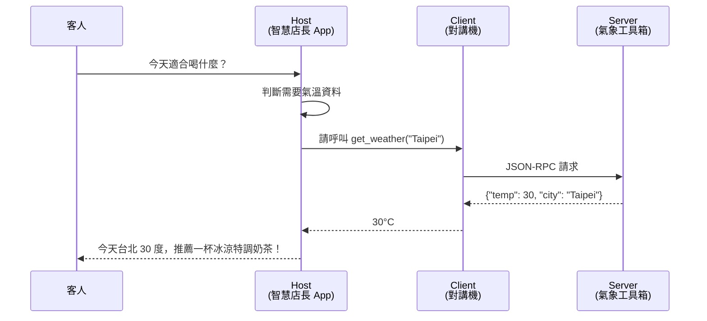
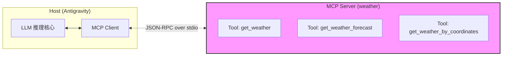

## 課程大綱
| 階段 | 目標 | 學完你能... |
| :--- | :--- | :--- |
| **Part 0** | 回顧 0409 | 複習 P-R-W-S-K 五大元件 |
| **Part 1** | **認識 MCP**（觀念） | 說出 Host / Client / Server 三層關係 |
| **Part 2** | **設定 MCP**（工具） | 讓 Antigravity 接上氣象 Server |
| **Part 3** | **動手建 App** | 讓 AI 依氣溫主動推薦飲品 |
| **Part 4** | 驗收 & 交作業 | 展示成果 |

---

# Part 0 · 回顧 0409：五大元件

## 專案背景：天下茶屋 (Tenka Tea) 智慧點餐 App

「天下茶屋」位處技術密集型的高科技辦公園區。為了維持品牌傳承的品質標準並提升效率，全店決定導入智慧點餐 App。這套 App 必須承載店內的業務規則與產品定價數據。

0409：我們完成了 App「產品大腦」的基礎建置：讓它能**執行任務**（下單）、**處理商業邏輯**（訂單金額計算）、**精準攔截錯誤**（熱奶茶不可以加珍珠）。

---

## 概念回顧

> **你寫的這些 Markdown 文件，就是 App 的規格書。**
> AI 讀取你的規格書，幫你把 App 蓋出來。

| 組件名稱 | 對應的程式概念 | 在 App 裡的實際作用 |
| :--- | :--- | :--- |
| **Knowledge** | 知識庫 (資料庫) | 所有品項、定價、事實數據的唯一事實來源 |
| **Persona** | UI 語氣 / 品牌設定 | 決定 App 跟用戶說話的方式（例：資深店長） |
| **Rules** | `if / else` 商業邏輯 | 攔截不合規的操作（例：超出外送 3km 不受理） |
| **Skills** | `function()` 功能模組 | App 的運算核心（算錢、折扣、運費邏輯） |
| **Workflows** | 操作流程 / SOP | 引導用戶一步步完成任務（例：點餐流程） |

**Skill 都要自己寫嗎？** 還有另一種方式，就是透過 MCP 去接外部的工具。今天會新增一個 Skill（`get_weather_skill`）與一條 Rule（`weather_recommendation`），讓 App 透過 **MCP** 去問外部天氣服務，並據此動態調整推薦飲品。

---
# 0423 MCP 實作 - 天下茶屋個案實作：讓 App 會看天氣

讓你的 AI App 先「看一眼外面幾度」，再根據氣溫推薦冰飲或熱飲。

---

# Part 1 · 認識 MCP（觀念篇）

## 1.1 今天的任務與學習目標

> 讓 Antigravity 裡的 AI 學會「先看一眼外面幾度」，然後根據天氣推薦冰飲或熱飲。

### 學習目標打勾檢核

- [ ] 我能說出「MCP」是什麼、為什麼要用
- [ ] 我能在 Antigravity 裡成功註冊一個 MCP Server
- [ ] 我能寫出 `.agent/` 目錄下的 5 種規格檔
- [ ] 我能讓 AI 根據目前氣溫，對我說出對應的開場白

> 這四項對應 0409 的 P-R-W-S-K 再加上「外部工具對接」。

### 完成後你的資料夾會長這樣（先看輪廓）

```
天下茶屋專案/
└── .agent/
    ├── knowledge/     ← 知識庫（品項、城市、規則基準）
    ├── persona.md     ← AI 的個性(APP回應訊息的語氣)
    ├── rules/         ← 商業規則（外送 3km、氣候聯動推薦）
    ├── skills/        ← 能力模組（今天主角：接 MCP 查天氣）
    └── workflows/     ← 點餐 SOP
```

> **個別檔案的完整清單**會在 Part 3 開頭的「建檔藍圖」完整呈現。

---

## 1.2 什麼是 MCP？

**MCP (Model Context Protocol，模型上下文協定)** 是由 Anthropic 於 2024 年 11 月發布的**開放式通訊協定**，用來規範 AI 應用與外部工具之間的標準化連接方式。

### 為什麼要發明 MCP？—— M×N 整合爆炸

傳統做法下，每個 AI 應用要串每個外部系統都得寫一套：**M 個 AI × N 個系統 = M×N 套整合**。
MCP 把接口統一後，複雜度降為 **M+N**：任何符合 MCP 的 Client 都能連任何符合 MCP 的 Server。

> **建立一套通用規則**，讓元件即插即用。

---

## 1.3 MCP 的三層架構：Host / Client / Server

| 層級 | 元件 | 職責 | 本課程中是誰 |
| :--- | :--- | :--- | :--- |
| **Host** | 執行 AI 的應用程式 | 使用者直接接觸、裡面跑 LLM 的程式，負責 UI 與 MCP 連線管理 | 開發階段：**Antigravity 編輯器**；上線後：**手機上的天下茶屋 App**|
| **Client** | 協定客戶端 | Host 內部自動產生，與單一 Server 一對一連線 | Antigravity 內部自動產生的連線橋樑，負責對外與 MCP Server 溝通（**看不到、不用寫**）|
| **MCP Server** | 工具服務端 | 對外提供一組能力（Tools） | `@mariox/weather-mcp-server`（一支跑在背景的 Node.js 程式）|

### 完整流程



> 只要在 Antigravity (Host) 裡，把 `.agent/` 規格檔寫好，Client 和 Server 都會自動處理。

### 三層快速對照

| 層級 | 在這堂課裡是誰 | 你要寫嗎？ |
| :--- | :--- | :--- |
| **Host** | Antigravity 編輯器（開發階段） | 要——寫 `.agent/` 五大元件 |
| **Client** | Antigravity 內部自動產生的連線橋樑 | 不用——看不到也不用寫 |
| **Server** | `@mariox/weather-mcp-server`（背景跑的 Node.js 程式） | 不用——npm 裝好就有 |

---

## 1.4 你要做什麼？不做什麼？

| 誰做 | 做什麼 | 你需要動手嗎？ |
| :--- | :--- | :--- |
| **你** | 寫 `.agent/` 底下的五大元件、編輯 `mcp_config.json` | 要 |
| **Antigravity** | 自動產生 MCP Client、管理與 Server 的通訊 | 不用 |
| **MCP Server 開發者** | 寫好 Server 程式碼發布到 npm | 不用（遠端現成的）|

---

# Part 2 · 設定 MCP（工具篇）

## 2.1 環境檢核

### 檢核 1：Node.js 已安裝

> **什麼是 Node.js？** 一個幫電腦跑程式的環境，MCP Server 需要它在背後工作。你不用寫 Node 程式，只要確認它「有裝」。

- 按 `Win + R` → 輸入 `cmd` → Enter
- 會打開**黑底白字視窗**（終端機）
- 輸入 `node -v` → Enter
- 看到 `v20.x.x` → 有裝
- 若顯示 `不是內部或外部命令` → 去 [Node.js 官網](https://nodejs.org/) 下載 LTS 版，一路下一步

### 檢核 2：找到0409的 `.agent/` 資料夾

整堂課所有檔案都會放在這個資料夾。

---

## 2.2 認識 mcp_config.json

### A. mcp_config.json 在哪裡？

Antigravity 把 MCP 設定存在一個叫 **`mcp_config.json`** 的檔案裡。

- **Windows 路徑**：`C:\Users\<你的使用者名字>\.gemini\antigravity\mcp_config.json`
  - 範例：`C:\Users\yuchi\.gemini\antigravity\mcp_config.json`
- **macOS 路徑**：`~/.gemini/antigravity/mcp_config.json`

> **補充：MCP 設定是「全域」的，不是每個專案各自一份！**
>
> `mcp_config.json` 放在你電腦的**使用者主目錄**下，**不是**放在「天下茶屋專案/」這個專案資料夾裡。這代表：
> - **設定一次，所有 Antigravity 專案都能用**：今天註冊的 `weather` Server，下週做別的專案也叫得到。
> - **一個使用者一份設定**：同一台電腦的同一個 Windows 使用者，所有專案共用這份 `mcp_config.json`。
> - **換電腦 / 換使用者就要重新設**：複製 `.agent/` 到別台電腦，`mcp_config.json` 不會跟過去。
>
> **例如**：像「手機的 Wi-Fi 設定」——設一次整支手機都能連網，不是每個 App 自己填一次。

---

### B. 怎麼打開它？

**方式一：透過 Antigravity 介面（推薦新手）**

1. **按 `Ctrl + L`** 叫出右側 Agent Panel（若沒看到，再按一次）
2. 點 Agent Panel **頂端的 `...` 按鈕**（更多選項 / More Options）
3. 選單選 **`MCP Servers`**
4. 點 **`Manage MCP Servers`**
5. 點 **`View raw config`** → **`mcp_config.json`** 在編輯器開啟


> **什麼是 JSON？** 電腦讀的「表格格式」，用 `{ }` 和 `"引號"` 組成。**標點符號一個都不能少**（尤其是逗號）。不用硬背規則，整段複製貼上就好。

---

### C. 它長什麼樣？（最小骨架）

```json
{
  "mcpServers": {
    "<你取的名字>": {
      "command": "<要執行的 CLI 指令>",
      "args": ["<參數 1>", "<參數 2>"]
    }
  }
}
```

**欄位解釋**：

| 欄位 | 說明 | 範例 |
| :--- | :--- | :--- |
| `mcpServers` | 固定外層 key，所有 Server 都塞在這裡 | — |
| `<你取的名字>` | 這個 Server 在你 App 內的識別名（隨你命名，但建議語意化）| `weather`、`line` |
| `command` | 啟動 Server 的 CLI 指令 | `npx`、`python`、`node` |
| `args` | 傳給 command 的參數陣列 | `["-y", "@mariox/weather-mcp-server"]` |

### 套用到本課程的氣象 MCP

以今天的 `@mariox/weather-mcp-server` 為例，每個欄位對應：

| 欄位 | 該填什麼 | 為什麼 |
| :--- | :--- | :--- |
| `<你取的名字>` | `"weather"` | 後面 Skill 會用這個名字呼叫它 |
| `command` | `"npx"` | 這是 Node.js 套件，用 `npx` 啟動最方便（不用事先 `npm install`）|
| `args` | `["-y", "@mariox/weather-mcp-server"]` | `-y` = 自動回答 yes；後者是 npm 套件全名 |
| `env` | **不需要** | 這個套件免 API Key |
| `cwd` | **不需要** | 不依賴特定工作目錄 |

**最終要貼的內容**：

```json
{
  "mcpServers": {
    "weather": {
      "command": "npx",
      "args": ["-y", "@mariox/weather-mcp-server"]
    }
  }
}
```

> **為什麼這麼簡短？** 因為 `@mariox/weather-mcp-server` 免 API Key。換成需驗證的套件（如 LINE），才會多一個 `env` 欄位塞 Token（下週教）。

> 挑 Server 的四要點、去哪找 MCP Server → **附錄 B**。

---

## 2.3 安裝氣象 MCP Server（動手）

做完這一步，AI 才擁有「查天氣」這個能力。

### Step A：打開 `mcp_config.json`

照 §2.2 B 方式一操作（`Ctrl+L` → `...` → MCP Servers → Manage → View raw config）。

### Step B：貼上 Server 設定

把下面整段**複製貼上**（不要自己打字避免漏標點）：

```json
{
  "mcpServers": {
    "weather": {
      "command": "npx",
      "args": ["-y", "@mariox/weather-mcp-server"]
    }
  }
}
```

> **本課程使用的 MCP Server 來源**
> - **npm 頁面**：<https://www.npmjs.com/package/@mariox/weather-mcp-server>
> - **GitHub 原始碼**：<https://github.com/mariox/weather-mcp-server>
> - **背後 API**：[Open-Meteo](https://open-meteo.com/) — 免費、免申請 API Key、支援全球城市

> **注意 — 不要自己跑 npx！**
> 很多同學會把 `npx -y @mariox/weather-mcp-server` 貼到 cmd 黑視窗跑 → 畫面卡住 → 以為壞掉按 Ctrl+C。
> **正確做法：填進 `mcp_config.json`，讓 Antigravity 自己去啟動。** 你不用在終端機跑任何東西！

> 若 `mcpServers` 已有其他項目，只要加 `"weather": { ... }` 這段，**不要整段蓋掉**。
>
> 例如如果要再加入 LINE Server，正確做法是在裡面**新增**，不是取代整份檔案：
>
> ```json
> {
>   "mcpServers": {
>     "weather": {
>       "command": "npx",
>       "args": ["-y", "@mariox/weather-mcp-server"]
>     },
>     "line": {
>       "command": "npx",
>       "args": ["-y", "@line/line-bot-mcp-server"]
>     }
>   }
> }
> ```
>
> 兩個 Server 之間記得加逗號，少一個逗號整份 JSON 就壞掉。

### Step C：存檔並完整重啟 Antigravity

> **注意：一定要完整重啟！**
> 是**把 Antigravity 視窗完全關掉（紅叉叉）再重新打開**。
> 省略這步 → AI 會說它沒有 `get_weather` 工具 → 會卡很久。

- `Ctrl + S` 存檔
- 按右上角關閉 Antigravity
- 重新開啟

> **改了不同東西，重新載入的方式不同：**
>
> | 改了什麼 | 要做什麼 |
> | :--- | :--- |
> | `mcp_config.json`（MCP 設定） | 完整重啟 Antigravity |
> | `.agent/` 裡的任何檔案（skill / workflow / rules / persona 等） | 開新對話即可 |
>
> 原因：MCP Server 是背景執行的獨立程式，改設定要重啟那個程式；`.agent/` 的規格檔只是每次新對話讀進來的文件，不需要重啟。

### Step D：驗收（三步驗收法）

**Step D-1：列出工具**

在新對話問：
> 「你現在有哪些 MCP 工具可以用？」

- ✅ 列表中出現 `get_weather` → 過關
- ❌ 沒提到 → 跳回 Step C 重啟、或看附錄 A Q1

**Step D-2：實測呼叫**

問：
> 「請用 get_weather 工具查 Taipei 現在氣溫，並告訴我你呼叫了哪個工具」

- ✅ AI 回應中明確提到呼叫了 `get_weather`，且畫面上出現工具呼叫的記錄 → 確認成功
- ❌ AI 直接回答數字但沒有工具呼叫記錄 → 可能是幻覺或自行搜尋，MCP 未正確啟動，跳回 Step C
- ❌ 「我無法取得即時資料」→ 附錄 A Q2

**Step D-3（出錯時才用）：查 MCP Log**

- `Ctrl + Shift + P` → 輸入 `MCP: Show Logs`
- 看到 Server 啟動訊息 → 啟動成功
- 看到紅字 `Error` → 把錯誤拿來問 AI 或查附錄 A

> **新手最常見的「假成功」**：
> 1. 只重啟對話、沒重啟整個 App → Tool 列表還是舊的
> 2. JSON 少一個逗號 → Antigravity 默默忽略那個 Server
> 3. 套件名拼錯 → `npx` 會等很久然後失敗（看 Show Logs 才發現）

---

# Part 3 · 動手建 App（K → P → R → S → W）

> **Part 3 核心原則**：嚴格按 **K → P → R → S → W** 順序建檔。
> 先建「事實（知識庫）」再建「個性」、再建「規則」、再建「能力」、最後串「流程」。


## 建檔藍圖（完整版）

以下是這一 Part 結束後 `.agent/` 資料夾的最終長相：

```
天下茶屋/
└── .agent/
    ├── knowledge/
    │   └── product_list.md              ← 店裡的產品與定價數據
    ├── persona.md                       ← AI 的品牌性格設定
    ├── rules/
    │   ├── delivery_threshold.md        ← 外送範圍規則
    │   ├── discount_threshold.md        ← 滿額折抵規則（今天補強）
    │   └── weather_recommendation.md    ← 氣候感測聯動推薦規則（今天新增）
    ├── skills/
    │   ├── calculate_total.md           ← 結帳運算
    │   └── get_weather_skill.md         ← 今天的主角（今天接 MCP）
    └── workflows/
        └── order_beverage.md            ← 點餐 SOP
```

**建檔進度打勾**：

- [ ] §3.1 `knowledge/product_list.md`
- [ ] §3.2 `persona.md`
- [ ] §3.3 `rules/delivery_threshold.md`
- [ ] §3.3 `rules/discount_threshold.md`（今天補強）
- [ ] §3.4 `skills/calculate_total.md`
- [ ] §3.4 `skills/get_weather_skill.md`（今天 MCP 主角）
- [ ] §3.4 `rules/weather_recommendation.md`（接在 Skill 之後建）
- [ ] §3.5 `workflows/order_beverage.md`


> 用表格矩陣，方便 AI 精準執行


---

## 3.1 建 Knowledge：事實資料庫

### 建立 `.agent/knowledge/product_list.md`

在 `我的練習0423/.agent/knowledge/` 貼上今天新增的部份：

```markdown
---
功能名稱: 天下茶屋：產品與定價清單 (Product Data)
版本編號: v1.0.0
修改日期: 2026-04-23
功能類型: 系統知識數據庫
內容描述: 本文件定義了天下茶屋 App 中所有的產品編碼、名稱與對應單價，作為運算引擎之事實來源。
---

# 系統知識庫：天下茶屋產品與定價數據

## 1. 基礎實作規劃 (人類好閱讀版)

本清單規定了 App 系統中所有可供下單的產品及其基礎單價：

### 核心茶飲清單

- **天下紅茶**：單價每杯 $40 元。
- **天下綠茶**：單價每杯 $35 元。
- **特調奶茶**：單價每杯 $55 元。

### 當期促銷活動

- **三週年慶優惠**：折扣碼 `TENKA_80`，套用 0.8 倍率（八折）。

### 本店地理資料（MCP 氣候感測用）

- **分店名稱**：台北旗艦店
- **查詢城市（傳給 MCP）**：`Taipei`（建議用英文，辨識最穩定）

---

## 2. 進階實作規格 (AI好理解版)

### 產品數據表 (Product Master Data)

| 品項代碼 (ID) | 產品名稱 (Name) | 基礎單價 (Price) |
| :--- | :--- | :--- |
| **TEA_RED** | 天下紅茶 | 40 |
| **TEA_GRN** | 天下綠茶 | 35 |
| **MILK_TEA** | 特調奶茶 | 55 |

### 促銷活動數據表 (Promotion Data)

| 折扣碼 (Promo Code) | 活動名稱 | 折扣倍率 (Rate) |
| :--- | :--- | :--- |
| **TENKA_80** | 三週年慶優惠 | 0.8 |

### 店鋪資料

- **天氣查詢城市**：`Taipei`
```

> **補充：K (知識庫) 與 R (業務邏輯) 為何要分開？**
> 1. **Knowledge 只放「事實」**：產品單價、城市名、折扣率等**定義型資訊**。
> 2. **Rules 才放「校驗邏輯」**：`.agent/rules/` 的規則檔參考知識庫事實來做校驗。
>
> **好處**：未來要把 3km 改成 5km 時，只需改一處，不用改 Rule 檔。這就是「數據驅動」設計。

### 階段驗收

> **注意 — 改檔之後要「確認 AI 已讀取最新資料」！**
> 在 Antigravity 中，AI 每次**新對話**才會重讀 `.agent/` 資料夾。舊對話裡改檔再問，AI 還是用舊資料回答。
> **標準動作：改完檔 → 開新對話 → 驗收**。

**確認 AI 已讀取最新資料**，輸入：
> 「顯示本店資訊與產品清單」

AI 回答「台北旗艦店（Taipei）」並列出 3 種茶飲。

> **補充**：常踩的四大坑：不重啟、不模擬啟動 App、中文城市、終端機跑 npx。

---

## 3.2 建 Persona：AI 的個性

### 建立 `.agent/persona.md`

```markdown
---
功能名稱: 天下茶屋智慧店長之核心性格 (Persona)
版本編號: v1.0.0
修改日期: 2026-04-23
功能類型: 身分性格設定
內容描述: 規範天下茶屋智慧店長之品牌溝通風格與專業背景定義。
---

# 身分設定：天下茶屋智慧 App 服務風格 (Persona)

## 1. 基礎實作規劃 (人類好閱讀版)

本項規劃規定了 App 展現於顧客面前的服務形象與溝通風格：

### App 服務定位

- **名稱**：天下茶屋智慧服務專家。
- **專業背景**：具備十餘年茶飲業管理經驗，對於品質控管與顧客服務具備極高標竿。

### 互動風格描述

- **語氣**：表現出專業、溫暖且富有耐心的服務態度；多用「您」稱呼客戶。
- **行為準則**：在訊息回應中應主動提及服務細節（例：提醒熱飲燙口），並在異常操作中維持品牌優雅。
- **開場風格**：對話開始時，依當前氣溫主動推薦適合飲品，語氣溫暖自然（例：「今日台北 30°C，建議您來一杯冰涼的特調奶茶」）。
- **禁忌**：不在未確認訂單前強制結帳。
```

---

## 3.3 建 Rules：商業防火牆

> **思考題**：Knowledge 定義的是「事實」，現在要建立「校驗邏輯」來執行商業規則。
> 這一節建 **兩支規則檔**：外送範圍限制與滿額折抵。氣候推薦規則（`weather_recommendation`）依賴 Skill 提供的氣溫數值，會在 §3.4 Skill 建完後緊接著建立。

### 建立 `.agent/rules/delivery_threshold.md`

```markdown
---
功能名稱: 天下茶屋外送範圍規則 (Delivery Rule)
版本編號: v1.0.0
修改日期: 2026-04-23
功能類型: 業務執行規則
內容描述: 規範 Agent 如何依據配送距離決定服務受理範圍。
---

# 業務規則：外送範圍限制 (Delivery Rule)

## 1. 基礎實作規劃 (人類好閱讀版)

本項規則旨在保護營運品質，規範系統如何依據距離決定是否接單：

### 邏輯觸發條件

- **超出範圍**：當外送距離超過 **3 公里**時，系統應強行攔截訂單。
- **服務範圍**：距離 **3 公里內**正常受理。

### 回報文字建議

- 超出範圍時提示：「抱歉，天下茶屋目前僅限 3 公里內配送。」

---

## 2. 進階實作規格 (AI好理解版)

### 邏輯決策表 (Decision Table)

| 距離 | 執行動作 |
| :--- | :--- |
| **> 3km** | 強制攔截，回覆「抱歉，天下茶屋目前僅限 3 公里內配送。」 |
| **<= 3km** | 允許受理，繼續點餐流程 |
```

### 階段驗收

**模擬用戶在 App 介面操作**：將配送距離設為「5 公里外」。

AI 會依 `delivery_threshold` 攔截訂單並顯示提示訊息「抱歉，天下茶屋目前僅限 3 公里內配送」。

---

### 建立 `.agent/rules/discount_threshold.md`

```markdown
---
功能名稱: 天下茶屋滿額折抵規則 (Discount Threshold)
版本編號: v1.0.0
修改日期: 2026-04-23
功能類型: 業務執行規則
內容描述: 定義顧客訂單達到金額門檻後的自動折抵邏輯。
---

# 業務規則：滿額折抵 (Discount Threshold)

## 1. 基礎實作規劃 (人類好閱讀版)

### 折抵邏輯

- 套用折扣碼後的金額每滿 **$1000**，自動折抵 **$100**。

---

## 2. 進階實作規格 (AI好理解版)

### 折抵決策表 (Threshold Matrix)

| 條件 | 折抵金額 |
| :--- | :--- |
| `total >= 1000` | `floor(total / 1000) × 100` |
| `total < 1000` | `0` |
```

---

## 3.4 建 Skills：今日主角

本節建立兩支 Skill：**結帳運算**（0409 回顧）與 **氣候感測**（今天 MCP 對接）。

### 建立 `.agent/skills/calculate_total.md`（0409 回顧版）

```markdown
---
功能名稱: 結帳金額運算技能 (Calculate Total)
版本編號: v1.0.0
修改日期: 2026-04-23
功能類型: 核心運算技能
內容描述: 處理顧客結帳時的金額加總、折扣套用與滿額折抵計算。
---

# 核心技能：結帳金額運算 (Calculate Total)

## 1. 基礎實作規劃 (人類好閱讀版)

本技能負責將顧客的訂單內容轉換為最終應付金額，具備以下核心能力：

### 金額運算步驟

- **步驟 1：品項加總**：依 Knowledge `product_list.md` 產品數據表之單價，將每項數量乘以單價並加總。
- **步驟 2：折扣碼套用**：查詢 Knowledge `product_list.md` 促銷活動數據表，取得折扣碼對應倍率後套用。
- **步驟 3：滿額折抵**：依 Rules `discount_threshold.md` 的門檻設定，計算折抵金額。

### 輸出格式

- 顯示：品項小計、折扣套用結果、最終應付金額。

---

## 2. 進階實作規格 (AI好理解版)

### 運算邏輯表 (Logic Matrix)

| 運算階段 | 輸入 | 計算說明 | 輸出 |
| :--- | :--- | :--- | :--- |
| **品項加總** | 品項代碼、數量 | 依 Knowledge `product_list.md` 單價表：`Σ(單價 × 數量)` | 小計 |
| **折扣套用** | 小計、折扣碼 | 依 Knowledge `product_list.md` 促銷表取倍率：`小計 × 倍率` | 折後金額 |
| **滿額折抵** | 折後金額 | 依 Rules `discount_threshold.md` 執行折抵 | 最終應付金額 |

單價資料請參照 Knowledge `product_list.md` 產品數據表，不在此重複定義。
```

---

### 建立 `.agent/skills/get_weather_skill.md`（MCP 對接）

```markdown
---
功能名稱: 氣候感測技能 (Get Weather Skill)
版本編號: v1.0.0
修改日期: 2026-04-23
功能類型: 環境感知 / MCP 對接技能
內容描述: 透過 MCP Server「weather」之 get_weather 工具取得即時氣溫，提供給 Persona 與 Rules 作為決策依據。
---

# 核心技能：氣候感測 (Get Weather Skill)

## 1. 基礎實作規劃 (人類好閱讀版)

本技能為 App 開啟「環境感知」能力，透過 MCP 協定對接外部氣象服務：

### 技能職責

- **核心能力**：取得指定城市當前氣溫數字。
- **呼叫對象**：MCP Server 名為 `weather`（即 `@mariox/weather-mcp-server`）。
- **呼叫工具**：Server 提供的 `get_weather` 工具（名稱來自套件官方文件，可透過 Part 2 Step D-1「你現在有哪些 MCP 工具可以用？」確認）。
- **參數來源**：讀取 Knowledge `product_list.md` 中「店鋪資料」的天氣查詢城市（本店：`Taipei`）。

### 執行流程

1. 從 Knowledge 讀取天氣查詢城市（`Taipei`）。
2. 透過 MCP 呼叫 `weather` Server 的 `get_weather(city="Taipei")`。
3. 回傳氣溫數值（°C），供 Workflow S0 或 Persona 使用。

### 失敗處理

- 若 Server 無回應或參數錯誤 → 回傳空值，Workflow 改走「通用推薦」備援路徑（不中斷服務）。

---

## 2. 進階實作規格 (AI好理解版)

### 技能呼叫規格 (Skill Specification)

| 欄位 (Field) | 內容 (Value) |
| :--- | :--- |
| **mcp_server** | `weather` |
| **tool_name** | `get_weather` |
| **input_param** | `city: string`（來源：Knowledge 天氣查詢城市） |
| **output_field** | `current_temp: number` (°C) |

### 錯誤處理矩陣 (Error Handling)

| 錯誤情境 (Scenario) | 處理動作 (Action) | 降級輸出 (Fallback) |
| :--- | :--- | :--- |
| Server 未啟動 | 回報「氣候感測暫時無法使用」 | 顯示預設推薦（不套用 weather_recommendation） |
| 城市名不合法 | 回報參數錯誤 | 提示改用 `Taipei`（英文） |
| 網路逾時 | 重試 1 次，仍失敗則降級 | 同上 |
```

> **補充：這行指令背後發生了什麼事？（連動機制解密）**
> 為什麼寫這句中文，AI 就會去動 MCP？靠的是**「名稱對齊 (Naming Alignment)」**：
> 1. **意圖比對**：AI 讀到 `get_weather_skill` → 去搜尋 `.agent/skills/get_weather_skill.md`
> 2. **能力轉發**：該 Skill 檔定義要調用名為 `weather` 的 MCP 工具
> 3. **工具執行**：AI 呼叫 `get_weather` 工具，向 `@mariox/weather-mcp-server`（Antigravity 啟動時已在背景執行）取得氣溫數據
> 4. **規則套用**：取回氣溫後，依 `rules/weather_recommendation.md` 決定推薦哪款飲品
>
> **這就是 P-R-W-S-K 的關鍵連動點！提醒：命名必須完全一致。**

> **補充：為什麼 Skill 只做「取得氣溫」，不做「推薦冷熱飲」？**
> 1. **單一職責**：`get_weather_skill` 就是純粹的資料擷取，輸出單一數值。
> 2. **邏輯與能力分離**：把「氣溫 → 推薦哪款飲品」的決策放在 `rules/weather_recommendation.md`，未來若店家策略改變（例如加一條「雨天主推熱飲」），改 Rule 就好，Skill 不動。
> 3. **可重用性**：同一支 Skill 也能給未來的「依氣溫設定冷氣」「依氣溫提醒庫存」等其他情境用。

---

### 建立 `.agent/rules/weather_recommendation.md`（今天新增）

```markdown
---
功能名稱: 氣候感測聯動推薦規則 (Weather-Based Rules)
版本編號: v1.0.0
修改日期: 2026-04-23
功能類型: 業務執行規則
內容描述: 根據「氣候感測技能」回傳的氣溫數據，動態調整飲品推薦邏輯。
---

# 業務規則：氣候感測聯動推薦 (Weather Recommendation)

## 1. 基礎實作規劃 (商業邏輯)

當系統透過 `get_weather_skill` 取得即時氣溫後，應執行以下自動化動作：

- **高溫判定**：若氣溫 **高於 28°C**，系統偵測為「炎熱環境」，主推冷飲：「特調奶茶（冰）」。
- **常溫判定**：若氣溫落在 **15°C ~ 28°C**，系統偵測為「舒適環境」，主推招牌茶類：「天下紅茶」或「天下綠茶」。
- **低溫判定**：若氣溫 **低於 15°C**，系統偵測為「寒冷環境」，主推熱飲：「天下紅茶（熱）」。

---

## 2. 進階實作規格 (AI好理解版)

### 推薦決策表 (Recommendation Matrix)

| 觸發條件 (Condition) | 氣溫區間 | 推薦產品 (Primary) |
| :--- | :--- | :--- |
| **高溫** | `current_temp > 28` | 特調奶茶（冰） |
| **常溫** | `15 <= current_temp <= 28` | 天下紅茶 / 天下綠茶 |
| **低溫** | `current_temp < 15` | 天下紅茶（熱） |
```

> **補充：為什麼氣候推薦是 Rule 而不是 Skill？**
> - **Skill 做「能力」**：`get_weather_skill` 的職責只是「取得氣溫數字」——一個純粹的資料擷取能力。
> - **Rule 做「決策」**：「氣溫 > 28 推冷飲、< 15 推熱飲」是**商業決策**，屬業務規則範疇。
>
> 這個分工讓 Skill 可以在不同業務情境重用（例：改天茶屋想做「依氣溫自動調整飲品溫度建議」也能用同一支 Skill，只要換條 Rule）。

### 階段驗收

**模擬啟動 App（執行環境感知流程）**，點擊「今日推薦」查詢：
> 「獲取當前環境氣溫並顯示推薦選項」

成功標誌：
- AI 明確說出**具體溫度數字**（不是瞎編）
- 依規則推薦對應飲品

---

## 3.5 建 Workflow：串起所有流程

### 建立 `.agent/workflows/order_beverage.md`

```markdown
---
功能名稱: 智慧點餐 SOP 流程 (Order Beverage Workflow)
版本編號: v1.0.0
修改日期: 2026-04-23
功能類型: 操作流程 / SOP
內容描述: 定義天下茶屋智慧 App 自「App 啟動」到「訂單送出」的完整操作流程，串接 Persona、Rules、Skills 與 Knowledge 四大元件。
---

# 操作流程：智慧點餐 SOP

## 1. 基礎實作規劃 (人類好閱讀版)

本流程以狀態機方式描述 App 從啟動到結單的標準動線：

### 流程狀態定義

- **S0 (環境感知)**：App 啟動或新對話時，呼叫 `skills/get_weather_skill`，取得當前氣溫；依 `rules/weather_recommendation` 決定首頁主打推薦，並由 Persona 包裝成親切開場白。
- **S1 (需求選取)**：顧客選擇飲品品項（天下紅茶 / 天下綠茶 / 特調奶茶）、溫度、數量。
- **S2 (業務規則校驗)**：系統檢查 `rules/delivery_threshold`（3 公里限制）。不通過則退回 S1 並顯示提示。
- **S3 (結帳結算)**：呼叫 `skills/calculate_total`，依 Knowledge 品項表計算小計，查詢 Knowledge 促銷表套用折扣碼，並依 Rules `discount_threshold` 計算滿額折抵。
- **S4 (訂單確認)**：彙整訂單摘要並請顧客確認。確認後產出訂單編號，流程結束。

### 元件引用清單（這份 Workflow 用到哪些檔）

- Knowledge：`product_list.md`
- Persona：`persona.md`
- Rules：`delivery_threshold.md`、`discount_threshold.md`、`weather_recommendation.md`
- Skills：`get_weather_skill.md`、`calculate_total.md`

---

## 2. 進階實作規格 (AI好理解版)

### 狀態轉換表 (State Transition Matrix)

| 狀態 (State) | 觸發事件 (Trigger) | 執行動作 (Action) | 下一狀態 |
| :--- | :--- | :--- | :--- |
| **S0** | App 啟動 | 調用 `get_weather_skill` → 套用 `weather_recommendation` → 生成開場白 | S1 |
| **S1** | 顧客選品項 | 記錄 `item_code, qty, temp` | S2 |
| **S2** | 送出選擇 | 執行 `delivery_threshold` 校驗 | 通過 → S3；失敗 → 回 S1 |
| **S3** | 進入結帳 | 調用 `calculate_total` 計算 `final_total` | S4 |
| **S4** | 顧客確認 | 產出訂單編號並儲存 | 結束 |
```

---

# Part 4 · 驗收與交作業

## 4.1 最終驗收闖關

模擬啟動 App（全系統連動測試），依序檢查各模組：

- [ ] **感知測試 (S0)**：啟動 App 時，觀察 UI 是否主動顯示目前氣溫並依 `weather_recommendation` 更新推薦內容。
- [ ] **結帳運算 (`calculate_total`)**：選取兩杯天下紅茶 + 一杯特調奶茶，套用折扣碼 `TENKA_80`，觀察結帳是否正確算出 ($40×2 + $55) × 0.8 = $108。
- [ ] **外送校驗 (`delivery_threshold`)**：嘗試將配送地址設為 5 公里外，觀察 App 是否依 3 公里規則彈出阻止訊息。
- [ ] **環境連動挑戰**：將 Knowledge 的天氣查詢城市改為 `Reykjavik`（冰島）並重啟 App，觀察推薦是否自動切換為「天下紅茶（熱）」的熱飲模組。

**全部打勾 → 恭喜！你做出第一個具備「環境感知」能力的智慧 App。**

> **補充**：環境連動挑戰建議用「低溫城市」，備案：Reykjavik / Oslo / Helsinki。

## 4.2 交作業方式

課堂實測後給老師檢查，通過後截圖上傳至作業繳交區（未通過課堂實測的不算）。

---

# 附錄 A：常見錯誤 FAQ

### Q1：AI 說它沒有 `get_weather` 這個工具
1. **Antigravity 沒完整重啟** → 關掉視窗再開
2. **`mcp_config.json` 寫錯** → 檢查 JSON 格式（逗號、引號、大括號是否配對）
3. **Node.js 沒裝** → 重做 §2.1 檢核 1

### Q2：AI 說「我無法取得即時天氣」
- 檢查查詢城市是否可辨識（優先用英文 `Taipei`）
- 檢查網路是否連線（Open-Meteo API 需能連外）
- 在指令面板查 `MCP: Show Logs`，看 Server 有沒有錯誤

### Q3：改了檔案但 AI 回答還是舊的
- Antigravity 每個「模擬啟動 App」動作才會重讀 `.agent/`
- 請模擬啟動 App，不要在舊的執行環境裡繼續測試

---

# 附錄 B：進階補充（想深入再看）

> 今天的課不用這些也能完成；但想走得更遠、或日後自己挑 Server 時會用到。

## B.1 MCP Tools 與自定義 Skills 的分工

| 比較面向 | 自定義 Skill | MCP Tool |
| :--- | :--- | :--- |
| **定位** | 專屬於本應用的商業邏輯 | 可跨應用重用的通用能力 |
| **實作位置** | `.agent/skills/` 內的規格檔 | 獨立執行的 Server 程序 |
| **典型範例** | 結帳折扣公式、會員積點規則 | 天氣查詢、地圖定位、LINE 發送 |
| **耦合程度** | 與業務強耦合 | 與業務解耦，透過協定對接 |

## B.2 一個 Server 該包幾個 Tools？

**常見誤解**：「一個功能開一支 Server」。
**正確原則**：**依服務邊界劃分 Server** — 同一外部服務下的多個工具封裝於同一 Server，跨服務才另開。



**正確示例：依「外部服務」切 Server**（共 2 支 Server，含 4 支 Tools）

| Server 名稱 | 封裝的 Tools | 背後的外部服務 |
| :--- | :--- | :--- |
| `weather` | `get_weather`、`get_weather_forecast`、`get_weather_by_coordinates` | 同一個氣象 API |
| `line` | `push_message` | LINE Messaging API |

> **判斷口訣**：問自己「這些工具背後打的是**同一個外部服務**嗎？」
> - 是 → 同一 Server
> - 否 → 另開 Server

## B.3 去哪找 MCP Server？

社群已有數百個現成的 MCP Server，**不用自己寫**。三個主要來源：

| 來源 | 網址 | 特色 | 適合誰 |
| :--- | :--- | :--- | :--- |
| **Anthropic 官方清單** | [github.com/modelcontextprotocol/servers](https://github.com/modelcontextprotocol/servers) | 官方背書、最嚴謹 | 想求穩 |
| **Smithery 目錄** | [smithery.ai](https://smithery.ai) | 搜尋最方便、有分類與安裝量 | 想快速找 |
| **Awesome MCP Servers** | [github.com/punkpeye/awesome-mcp-servers](https://github.com/punkpeye/awesome-mcp-servers) | 社群整理、依主題分類 | 想探索冷門功能 |

**操作示範（Smithery 找天氣 Server）**：
1. 開啟 [smithery.ai](https://smithery.ai) → 搜尋 `weather`
2. 點進感興趣的項目
3. 頁面會提供**安裝指令**（`npx ...`）和**設定檔片段**，複製即可

> **補充**：Smithery 頁面上的 `@xxx/yyy` 是**它自己的目錄 ID**，不一定是 npm 套件名。不要直接塞進 `args`，要點進頁面看真正的 `command` 寫法。

## B.4 挑 Server 前要留意的四件事

新手容易挑到「看起來功能很強、實際跑不起來」的套件。採用前先看：

| 檢查點 | 要看什麼 | 踩雷範例 |
| :--- | :--- | :--- |
| **① 執行語言** | Node.js / Python / Go？電腦有對應 runtime 嗎？ | 電腦只有 Node.js，裝到 Python 套件 → 跑不起來 |
| **② 是否需 API Key** | README 有沒有寫「需申請 API key」？ | 課堂上學生各自申請 key，時間全泡湯 |
| **③ 新鮮度** | npm **last publish** 日期、GitHub 最近 commit | 兩年沒更新 → 背後 API 可能已變 |
| **④ 功能匹配** | Tools 清單是否符合需求？參數格式對嗎？ | 只想查城市氣溫卻挑到要傳經緯度的套件 |

**Node.js vs Python 的 `command` 寫法差異**：

```json
// Node.js 套件 → 用 npx
"command": "npx",
"args": ["-y", "套件名稱"]

// Python 套件 → 用 python -m
"command": "python",
"args": ["-m", "套件名稱"]
```

> **學校電腦注意**：本課程所有 MCP Server **只用 Node.js 版**，因為教室電腦**不保證有 Python**。挑選時看到 `pip install` 或 `python -m` 的，一律跳過。
