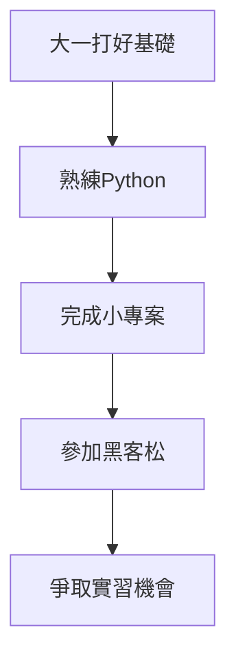

# A113221009 陳昱翔的履歷

## 關於我

### 基本資料
我叫陳昱翔，目前就讀資訊管理學系大二。
來自台北，對程式設計與人工智慧非常有興趣。

### 我的目標
我希望未來能成為一名優秀的 `軟體工程師` ，
並熟悉 **Python**、**Web 開發** 與資料分析技術。

### 我的興趣
- 打籃球
- 玩卡牌遊戲
- 收藏卡牌
- 跟AI聊天

> 迷失方向的時候，就先行動起來。

## 我學過的程式課程
目前正在學習：
1. 程式設計(一)
2. 程式設計(二)
3. AI創意工坊:智慧媒體與互動設計
4. 網頁程式設計

未來想學：
- Web 前端開發
- App 開發
- 人工智慧基礎

### 技能表
| 技能 | 熟練程度 |
| --- | --- |
| Python | 基礎學習中 |
| HTML | 基礎觀念 |
| Git | 基礎操作 |
| C語言 | 學習中 |

### 程式碼作品展示
> 這是一段基礎的可執行程式碼示範：

```python
# 使用 for 迴圈簡單印出文字
for i in range(1, 4):
    print("這是迴圈的第", i, "次執行！")
```

我的學習計畫（流程圖）

